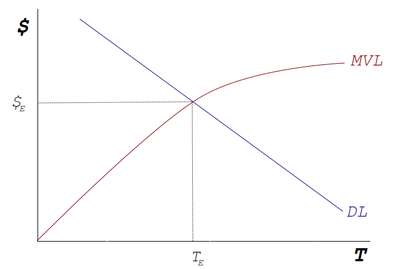
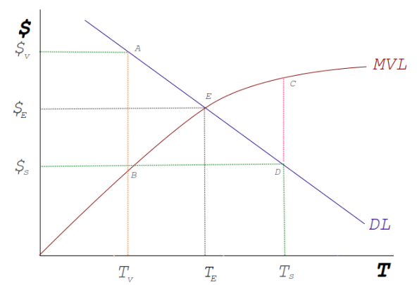

*Disclaimer: this is a working paper subject to future revisions*

# Introduction
Automated market makers (AMMs) on Ethereum are contracts that provide liquidity for token swaps while using relative levels of liquidity to establish clearing prices[ref]. For a given market, traders exhibit a demand for underlying liquidity, and trade volume relative to liquidity reflects this implicit demand. In an attempt to meet this demand, AMMs offer a share of trading revenue to providers of liquidity. Since token pairs are balanced at equilibrium, price divergence creates arbitrage opportunities to rebalance the pair. In particular, when a token price rises relative to the other token, it is swapped out in favour of the lower value token. This reduces the value composition of the token pair. For a liquidity provider, simply having held the tokens separately would have yielded a better return. This category of opportunity cost to liquidity provision is known as *impermanent loss*. The profit function for a liquidity provider is the gain in revenue minus the impermanent loss. For token pairs that are highly correlated such as stablecoin pairs, the impermanent loss is close to zero and the revenue is relatively high. The profit function for supplying to these pairs is then almost guaranteed to be positive. Conversely, for tokens that are not correlated with other tokens exhibit fairly high levels of impermanent loss, reducing the desirability for liquidity provision. The lower levels of liquidity then further exacerbate the situation since low liquidity pairs are volatile. If this wasn't enough, low liquidity tokens also struggle to attract trade volumes since gas prices are a fixed cost. Markets that are characterized by significant fixed costs exhibit increasing returns to scale. In other words, stablecoin pairs form a sort of monsopsony over liquidity providers. For these reasons, this paper argues that the incentives created by traditional AMMs do not properly relate to the market for liquidity and as such there is an over provision of liquidity to correlated pairs and an underprovision to tokens which are based on sound fundamentals but are otherwise uncorrelated with other tokens. In particular the price of LP tokens do not reflect the marginal price of liquidity. If they did, the stablecoin oversupply would be reduced and general returns in DeFi would rise significantly.

The corresponding journal entry for impermanent loss to a liquidity providers is a trader benefitting from an arbitrage trade. If the holder of an LP token could run a script that automatically rebalances their position by essentially abitraging the composite tokens when prices diverge, then they could internalize and reverse a great deal of impermanent loss, reversing the distortion in liquidity provision created by LP token pricing. The reason they can't is because of a phenomenon known as miner extracted value (MEV). On public, open blockchains, miners have power over how transactions are ordered for inclusion in a block. Since these transactions are transparent, miners can perform a form of front running where they can inspect the result of an incoming transaction and if the return is high, simply replace the transaction with an identical version but with their signature. For this reason, any large scale attempt to create an autorebalancing LP token would be seized upon by miners. The status quo then reflects a misallocation of capital and correcting it would require marginal liquidity pricing and MEV capture by liquidity providers. Such a correction to the liquidity provision market would result in an overall benefit to the entire DeFi economy.

Behodler is a protocol centered on an AMM aimed at creating a true market for liquidity, both by pricing liquidity correctly and be offering numerous mechanisms for users of Behodler to recapture MEV. The liquidity token, Scarcity (SCX), differs from traditional LP tokens in that it is also the medium of exchange for all swaps on Behodler. While the price of LP tokens is simply the combined price of the constituent token balance, Scarcity's price represents the  **marginal** value (or price) of the underlying liquidity, creating the necessary incentive for liquidity providers to match demand by traders for liquidity. While Scarcity clears the market for liquidity supply and demand for a given level of liquidity on Behodler, the broader goal of Behodler is to offer a corrective mechanism for liquidity provision to all of DeFi and to do so in a way that channels a portion of this gain to traders on Behodler and holders of Scarcity. In order to achieve this, Scarcity burns on transfer. Since the price of Scarcity is determined algorithmically, burning the supply guarantees a future price rise. The majority of Scarcity burning happens on external AMMs such as Uniswap and mostly by arbitrage traders. For every trade of SCX on Uniswap, the burned portion represents a taxation on arbitrage traders and since arbitrage is dominated by miners, Scarcity burning effectively redistributes MEV from token pairs back to users of Behodler. Because MEV is the corresponding journal entry for impermanent loss on an AMM, Scarcity burning effectively offers a DeFi wide corrective mechanism to capital misallocation created by incorrectly priced LP tokens. This process of capturing MEV through regular trade of Scarcity outside of Behodler is a process known as *automining* and forms a key pillar in accelerating the advance of Behodler as DeFi's true clearing house for liquidity. 

This paper charts a technical outline of all of the moving parts of Behodler, while weaving together the theory of marginal liquidity pricing and highlighting how every aspect of the protocol, including governance, is designed with the express purpose of recapturing MEV and hence correcting liquidity pricing and misallocation across DeFi.

# The Core of Behodler
While the positive externalities created by Behodler lend themselves to be exploited by downstream ecosystem dapps such as Limbo and Bonfire, the core protocol begins with the AMM. Understanding the working parts of the core assists in fleshing out the purpose of Behodler. 

Behodler AMM is comprised of three main parts:

1. The BehodlerAMM/Scarcity is one contract and houses all of Behodler's tradeable liquidity. Housing Scarcity in Behodler means that no transfers of Scarcity occur within Behodler. Instead, all internal SCX operations involve minting and burning, saving on gas and ensuring that MEV is only recaptured from sources external to Behodler.

2. Lachesis, named after an ancient greek goddess of fate, is the contract that gatekeeps which tokens can be listed on Behodler. Since all liquidity is housed in one contract, Behodler is vulnerable to scam tokens which give unbounded admin minting rights. Lachesis maintains a register of trustable tokens. In the short run, governance will ensure that only legitimate tokens are listed on Behodler. In the longer run, a secondary market for legitimacy can be created to allow permissionless token listing on Behodler where untrusted tokens are bonded with the governance token which is burnt in the event of suspicious activity.

3. Pyrotoken Reserve: Burning is not a requirement of the ERC20 standard which means that while many tokens are burnable, most by design and intention, are not. When listed on Behodler, burnable tokens such as Maker can be registered as burnable. On every swap, a fee is levied on burnable tokens and burnt. This provides a deflationary service to the holders of the burnable token. For tokens which are not burnable, the fee is sent to a burnable wrapper token called a Pyrotoken. Any holder of a token can mint its corresponding Pyrotoken at a prevailing redeem rate. Whenever the pyrotoken burns, the redeem rate automatically rises. This instantly transfers the effect of a burn to holders similar to a reflect token. Recall that impermanent loss is the comparison between an LP's token composition and the result of just holding the underlying tokens. Pyrotokens amplify this discrepancy by creating a greater incentive to HODL. The burning of input tokens on Behodler creates an automatic incentive for communities to route trade through Behodler and the existence of Pyrotokens acts as a incentived marketing instrument, a cryptocurrency referral fee for using Behodler. Holders of Pyrotokens are not only encouraged to avoid instruments subject to impermanent loss but have an incentive to attract more usage of Behodler since trade of the underlying token amplifies the value of their Pyrotokens.
Finally, Pyrotokens play an important part is promoting automining of SCX. Recall that token pairs containing SCX recapture MEV from external AMMs. Something like Pyro(SCX/USDC) would amplify the incentive to mint SCX/USDC LP token.

# The Philosophy of Behodler
In response to the misallocation of liquidity pricing in the broader Ethereum ecosystem, many AMMs have sought to double down on the oversupply of stablecoin liquidity by offering improved returns for correlated token liquidity provision. Uniswap V3's concentrated liquidity and Curve's bounded curvature of swaps are such examples. Behodler, by contrast, seeks to correct the pricing of liquidity in DeFi so that the allocation of capital is closer to the economic optimum. Understanding how this is achieved requires a deeper understanding into the nature of liquidity while paying careful attention to how Behodler relates to this. The first part of this section justifies the choice of bonding curve algorithm employed by Behodler, after which a theory on liquidity markets is posited. It concludes by explaining how Behodler acts as a true market for liquidity.

## Pricing in SCX
Consider a fictional version of Behodler with only two tokens listed, Dai and Eth. Assume also that the price of Eth on the open market is 2000 Dai. Suppose we add 1 unit of Dai which mints 10000 units of Scarcity (SCX) and that the next unit of Dai mints 9999 units of Scarcity. This implies that the first unit of SCX costs (1/10000=) 0.0001 Dai while the second costs (1/9999=)0.00010001 Dai and the third costs 0.00010002. Conversely, if there are 10 units of Dai in Behodler already (which implies the next unit of Scarcity costs 0.0001001 Dai) then we can redeem Dai by sending SCX back into Behodler. The previous unit of SCX costs 1/9991 Dai or 0.00010009 Dai. So with 1 unit of SCX we can redeem 0.00010009 Dai. The nature of Behodler is such that the supply curve of Scarcity is the same for all tokens. Behodler has no notion of relative token values so the first unit of Eth in this example will also create 10000 SCX. If the number of units of Eth and Dai stored in Behodler are the same, this implies the SCX price of both is equal. This position is unstable since a trader can provide 1 unit of Dai, receive some SCX and then redeem 1 unit of Eth with that SCX, implying a trade of 1 Eth for 1 Dai. In a situation like this, traders will keep adding Dai to Behodler in order to redeem Eth. As the levels of Dai rise, the SCX price of Dai will rise. That is, the amount of SCX that each additional unit of Dai can generate will fall. Similarly, as Eth is withdrawn, the amount of SCX that additional units of Eth can generate will rise. The result will be a gradual slipping of relative price between Dai and Eth until their relative prices reflect their true prices.


### Choosing the best bonding curve formula
The choice of bonding curve minting formula has an impact on the scalability of Behodler. To understand how liquidity scales, consider a version of Behodler that mints SCX along a linear supply function of P=Q for a token, T. What this means is that the price of the next unit of Scarcity is equal to the existing circulating supply of Scarcity so that the very first unit of SCX requires 1 T,the next unit requires 2 and so on. The total T in reserve is the integral of the price curve (denoting quantity of SCX with s),
$$
\int s \,ds \ = \frac{1}{2}s^2 + C
$$
$$
\implies T = \frac{1}{2}s^2 + C \tag{1}
$$
For a bonding curve, there is no initial Scarcity at T=0 so for the purposes of this analysis, assume C=0. The supply function of Scarcity in terms of T is
$$
S = \sqrt{2T}
$$

If liquidity is added to Behodler, it generates a change in Scarcity such that,
$$
{\Delta}S = \sqrt{2T_E} - \sqrt{2T_S} 
$$
where subscripts E and S represent end and start of a transaction respectively.

Suppose we wish to perform a swap of token T for token U. The roundtrip process is to mint SCX with T and then redeem that SCX for U. A swap then occurs where the SCX created by depositing T is equal to the SCX required to redeem U:
$$
\sqrt{2T_E} - \sqrt{2T_S} = {\Delta}S = \sqrt{2U_S} - \sqrt{2U_E}
$$
$$
\implies \sqrt{2T_S} + \sqrt{2U_S} = \sqrt{2T_E}  + \sqrt{2U_E}
$$
We can drop the common square root of two factor to get:
$$
\sqrt{T_S} + \sqrt{U_S} = \sqrt{T_E}  + \sqrt{U_E} \tag{2}
$$

This says that the sum of square roots of liquidity before a swap must equal the sum of square roots of liquidity after a swap. This is linear Behodler's version of the constant product formula pioneered by Uniswap, except that this is a constant sum formula. To see why, recall Uniswap's invariant is
$$
xy = K
$$
where x and y are liquidity levels after a swap. However, K is simply an xy from a previous swap. So using the notation from the previous analysis, the constant product formula can be re-written as
$$
T_{S}U_{S} = T_{E}U_{E}   \tag{3}
$$

Returning to linear Behodler, at the margin, the price of Scarcity in terms of token, T is given by
$$
P_{SCX_{T}} = \frac{d}{dT}S = \frac{d}{dT}(\sqrt{2T}) = \frac{\sqrt{2}}{2\sqrt{T}}
$$

To calculate the relative price of token T and U at the margin, take the ratio of their marginal prices:
$$
 \frac{P_{SCX_{T}}}{P_{SCX_{U}}} = \frac{\sqrt{U}}{\sqrt{T}}    \tag{4}
$$

To build an intuition, let's assume that T and U represent real world tokens. At the time of writing, Maker (MKR) was trading at just below $3000. Suppose we wish to create a linear Behodler that trades MKR for Dai and we wish to preseed the AMM with the right levels of liquidity such that at the margin, 1 MKR trades for 3000 Dai. Equation 4 becomes:
$$
 3000 = \frac{\sqrt{U}}{\sqrt{T}}  
$$

where T is Mkr and U is Dai. Let's add an initial Dai liquidity of 10000. This means
$$
 3000 = \frac{\sqrt{10000}}{\sqrt{T}}  
$$
$$
 3000 = \frac{100}{\sqrt{T}} 
$$
$$
 \implies \sqrt{T} = \frac{100}{3000}  
$$
$$
 T = 0.001111  
$$

In order to trade Mkr for Dai at 3000:1, a linear Behodler with 10000 Dai liquidity requires 0.001111 MKR. Suppose we wish to instead preseed linear Behodler with 1600 MKR. The dai required would be:
$$
 3000 = \frac{\sqrt{U}}{\sqrt{1600}}  
$$
$$
 \implies \sqrt{U} = 120000
$$
$$
 \implies U = 14400000000
$$

Preseeding linear Behodler with 1600 MKR requires we preseed the Dai reserve with over 14 billion Dai... which is more than the total supply of Dai.
This is what is meant by scalability. Depending on the bonding curve formula chosen, maintaining correct pricing becomes impossible between tokens of largely different values at high levels of liquidity. Linear Behodler is therefore only suitable for trade in stablecoins pegged to the same currency of tokens based on the same asset such as Weth and Seth. We wish Behodler to be applicable to all token classes and so require a bonding curve formula that can accommodate divergent prices between tokens.

Returning to equation 1 which calculates the T required for a given level of SCX, let's instead change it to an exponential function:
$$
T = e^S
$$
The production function of S is now:
$$
s = \ln{T}
$$
We now wish to inspect the scalability of liquidity. First, we need the marginal price of SCX:
$$
P_{SCX_{T}} = \frac{d}{dT}s = \frac{1}{T}
$$
For two tokens, T and U, the relative prices are then:
$$
 \frac{P_{SCX_{T}}}{P_{SCX_{U}}} = U/T
$$
Returning to the example of Mkr and Dai, for 10000 Dai, we have
$$
 3000 = 10000/T
$$
$$
\implies T = 3.3333
$$
Note that the ratio of prices is the same as the ratio of liquidity levels. This applies at all levels. For instance, 1600 MKR requires
$$
 3000 = U/1600 \implies U = 4800000
$$
At 1600 Mkr, we require 4800000 Dai which is 1:3000. The logarithmic production of SCX is therefore scalable to all levels of liquidity.

### Deriving Behodler's Swap Equation
```
"Here's the lightbulb ... logarithms" - JohnJohn, private Discord discussions of 2020
```
Next, it's important to understand what the logarithmic Behodler's version of the constant product swap equation is. Replace equation 2 with logarithmic equivalents to get:
$$
\ln{T_S} + \ln{U_S} = \ln{T_E}  + \ln{U_E} 
$$
Adding logs is the same as evaluating a logarithm of the product of their arguments:
$$
\ln{{T_S}{U_S}}=\ln{{T_E}{U_E}}
$$
To simplify, we drop the natural log on both sides to get
$$
T_{S}U_{S} = T_{E}U_{E} 
$$
This is identical to the constant product formula (equation 3) which shows that swapping tokens in a logarithmic Behodler exhibits the same properties as the generalized constant product AMM and is suitable for all types of tokens. Indeed it can be shown that the reverse is true: constant product AMMs like Uniswap are implicitly logarithmic. For this reason, the production of Scarcity happens along a logarithmic supply curve.


### The Law of Uniform Tentacle
At equilibrium, the dollar value of liquidity for each token listed on Behodler is equal. To understand this intuitively, consider a version of Behodler with two tokens listed, T and U. On the open market T is worth $80 and U is worth $20. Since we know the ratio of prices is equal to the ratio of their liquidity, we have,
$$
\frac{P_U}{P_T}= \frac{T}{U} = 80/4 \implies T = 4U
$$
Substituting in the market price for T and U shows that the value of the liquidity in Behodler is the same across all tokens when prices reflect market equilibrium. This is the **Law of Uniform Tentacle** that will become relevant when discussing the addition of new tokens to Behodler.

### The Nature of Scarcity
Behodler differs from other AMMs in that the token generated by the addition of liquidity is also the medium of exchange within the AMM. Liquidity claims in other AMMs are against a share of underlying liquidity spread linearly. This means that an LP token on Uniswap represents the average value of the constituent tokens within the pair. Consider the <a href="https://github.com/Uniswap/uniswap-v2-core/blob/4dd59067c76dea4a0e8e4bfdda41877a6b16dedc/contracts/UniswapV2Pair.sol#L140" target="_blank">code fragment</a> from Uniswap V2 core token pair contract:

```
//liquidity is the LP token balance [comment added by Justin Goro]
uint liquidity = balanceOf[address(this)]; 
bool feeOn = _mintFee(_reserve0, _reserve1);
uint _totalSupply = totalSupply;

//balanace0 and balance1 are the underlying token balances[comment added by Justin Goro]
// using balances ensures pro-rata distribution
amount0 = liquidity.mul(balance0) / _totalSupply;
amount1 = liquidity.mul(balance1) / _totalSupply;
```

This occurs in the function for redeeming liquidity pool tokens for underlying liquidity. As the last code comment explains, liquidity is redeemed proportional to LP tokens redeemed which means LP tokens are simply a share of underlying liquidity. LP tokens are equal in value to the combined market value of the underlying liquidity in the pair.

In contrast, Scarcity redeems at the margin and therefore reflects the marginal price of the underlying liquidity in the AMM. An implication of the Law of Uniform tentacle is that SCX reflects the marginal price of any liquidity on Behodler since every token is seeded with the same value of liquidity. This is why we can use the shorthand of saying SCX represents a claim on the marginal value of liquidity without specifying a token to redeem.

Since swapping occurs by minting SCX with one token and redeeming for another, simply minting SCX and holding is the equivalent of performing half a swap, or performing a swap with a virtual token that exists only in the future. Minting SCX is therefore a way of placing a bet on the marginal value of liquidity *in the future*. 
<br />

**A brief word on marginal analysis**

*Marginal economic analysis, first introduced and popularized by Carl Menger <link>, transformed the economic profession's ability to understand pricing. The diamond-water paradox famously stumped classical economists who wondered why something as essential for life (water) fetches a much lower market price than something relatively useless (diamonds). The paradox only occurs when comparing the total value of water to society vs the total value of diamonds but pricing in the market does not occur at this level. Instead, trade occurs for the next unit of an item. In particular, since there already is an abundance of drinking water, intentionally brought about by the provision of dams and situating settlements near rivers, the price of the next unit of water consumed is very low. By contrast, the scarcity of diamonds means that a large population of would-be owners stand ready to bid for the next diamond. Diamonds therefore fetch a high market price.*
\newpage

**Liquidity is not the same as token balance in reserve**

In the context of DeFi it is tempting to think of liquidity as synonymous with token reserves and the two are usually used in place of one another but in reality the purpose of a token reserve in an AMM is *to facilitate* liquidity. In financial markets, liquidity simply represents the degree to which a given size of trade leaves the market price unaffected. In a DeFi context, liquidity represents the degree to which trade can occur without price slippage. Since increasing token reserves increases liquidity, they have been treated as synonymous. However, Curve and Uniswap V3 demonstrate that while the relationship is always positive, the use of reserves can vastly affect the level of available liquidity within a given price range.

### Marginal Value of Liquidity
Bearing this distinction in mind, the marginal value of liquidity isn't the same as the market value of the underlying tokens in an AMM. The marginal value of liquidity, then, is the value of *not-slippage* for the next trader. Since slippage declines with increased liquidity, we know that the marginal value of liquidity is a positive function of liquidity, and since liquidity is a positive function of tokens in reserve, by transitivity, the marginal value of liquidity is a positive function of tokens in reserve. While traditional products such as food exhibit a declining marginal benefit that starts off high, liquidity in an AMM has a low starting marginal benefit that rises with increased liquidity. This is something we expect to see in products defined by network externalities such as phones. The first telephone offered no value to the owner, the second only allowed contacting the first telephone but as phone networks grew, the value of joining the network for the next consumer grew.
Similarly AMMs with low levels of liquidity offer very little benefit to the next trader but as liquidity rises, the value to the next trader rises. There are some limiting factors to runaway liquidity provision, however, such as possible market size and declining fee revenue per trade for very large trades.

### The Missing Market for Liquidity in traditional AMMs
The pricing of traditional LP tokens has no relation to the market for liquidity. Instead the price is purely compositional: the sum of the value of the token balances. Since liquidity and token balance are not the same, the compositional price is not the same as the liquidity value. The fact that Uniswap V3 positions are NFTs is testament to the fact that there is no clear relationship between token composition and liquidity value. This means that while there is a demand for liquidity by traders, there is no corresponding supply curve in traditional AMMs. If there were, then the demand for liquidity in a particular token would signal (through a price) the need for more liquidity. Token holders would then be induced at the margin to provide liquidity until the quantity demanded equals the quantity supplied. The creation of LP tokens is an act of hope that enough incentive exists for liquidity providers to meet the demand for liquidity and the existence of liquidity mining operations is a mechanism to bridge that hope. However, without a clear market price for liquidity for each token, liquidity will either be undersupplied or oversupplied. Consider figure 1 which charts the marginal value of liquidity (MVL) against the demand for liquidity by traders. The horizontal axis is the quantity of tokens, T, in an AMM reserve and since liquidity is positively related to reserve balance, we can graph liquidity curves on this axis. The curve MVL is the marginal dollar value of liquidity which is why the vertical axis is dollars.
\newpage



Note that demand for liquidity declines as more liquidity is added to the AMM since fewer trades are constrained by existing liquidity. The optimal point of liquidity provision is given by T~E~. At levels below T~E~ there is an excess and unmet demand for liquidity by traders. At values above T~E~, capital is being wasted as the benefit to the market from the excess liquidity is not being realized by traders.

### The Incentive to Supply Liquidity on a traditional AMM
Beyond owning the composition of tokens in a liquidity position, liquidity providers face risks and rewards to owning LP. The risk is impermanent loss and the expected rewards are revenue from trading fees. Denoting impermanent loss with I and revenue with R, the profit function for the LP provider is 
$$
\Pi = R - I
$$
These incentives tilt providers toward optimizing their portfolios for liquidity pools that exhibit high trading volume (fees) and highly correlated tokens (low impermanent loss). Stablecoin pairs exhibit high degrees of both and so disproportionately receive excess liquidity provision. For tokens that do not exhibit these qualities, the profit function is often expected to be negative and even though traders may demand more liquidity and even if the project fundamentals are good, the profit function faced by providers curtails liquidity provision to suboptimum levels. Adapting figure 1 to illustrate these two outcomes,
\newpage



T~v~ represents volatile or uncorrelated tokens that can experience periods of unchecked impermanent loss in excess of fee revenue. These liquidity markets are undercapitalized. The triangle AEB represents the missing market for token T~v~ (in microeconomics referred to as the deadweight loss). Conversely, token S is for high volume tokens in pools that are highly correlated. For instance, two stablecoins pegged to the same currency. Here, the triangle ECD represents wasted capital, liquidity in excess of trading requirements. 

### Evidence for a missing market for liquidity: Liquidity Mining
Beyond rigorous econometric inspection, how can we be sure that such an outcome exists? In particular that there is too much stablecoin liquidity provision and not enough for sound projects that do not possess highly correlated tokens such as Aave? In traditional markets when a pricing mechanism is either missing or suppressed, we see the emergence of parallel markets whose purpose is to fill the gap between demand and supply. These can take the form of black markets but often take the form of proxy markets. For instance, in Japan, gambling for money is illegal in most places but gambling for non monetary items is not illegal. It is also not illegal for a third party to resell items won through gambling and it is not illegal for gambling establishments to buy items they'd previously offered as winnings, provided it is not from the winner directly. As such, gambling houses offer winners tickets but are often accompanied by an adjacent gambling ticket buying business located in a separate building. A business that "just happens" to exist next door.
When we see the existence of such proxy business, we can conclude that a direct market either doesn't exist yet or is being suppressed. 
To some extent, liquidity mining plays the role of proxy market for missing liquidity market. Because there is no direct incentive to bridge demand for liquidity with supply on traditional AMMs, a boom in liquidity mining has taken off which is a strong indicator that most token markets are under-liquid. In support of the stablecoin over provision hypothesis, yield farms more often than not offer incentives for pairing their token with stablecoins in an effort to draw in the abundant liquidity found in stablecoin pools.

### A caveat on the missing market hypothesis
It should be noted that the sole purpose of liquidity mining isn't simply to bridge the gap between supply and demand. Recall that AMMs are characterized by network externalities which means that subsidizing bootstrapping yields disproportionate returns. Where we see an undersupply of liquidity in the wild is when a viable, popular a project has protocol token in high demand and yet has to provide additional incentives to pool their protocol token, despite the fact that it is in high demand on AMMs suggests that a price clearing mechanism is missing.

## Behodler is the missing market for liquidity
Since Scarcity is liquidity priced at the margin, it offers liquidity providers an incentive to match market demand for liquidity. The increasing value of SCX with respect to token reserves reflects the positive network externality of liquidity provision. Markets characterized by positive externalities exhibit increasing returns to subsidization, even if those markets clear at the margin. For instance, private markets for education such as fee based universities clear demand and supply but this doesn't mean that the current market equilibrium is necessarily the most beneficial for society. The existence of private bursaries is evidence that targeted subsidization of higher education yields a disproportionate benefit to society.
Similarly, while the existing Scarcity price clears the demand and supply for liquidity on Behodler for the current level of liquidity, it can still benefit from subsidies to the demand for Scarcity. Since Scarcity is priced algorithmically, reducing supply through burning  means that minting more requires a rise in the price. Burning, therefore, is a way of guaranteeing a future price rise. In particular, the most frequent burning happens in liquidity pools on traditional AMMs, in effect redistributing value form the incorrectly priced liquidity pools into Behodler where it is priced at the margin through the Scarcity price.
The design of Scarcity as a logarithmically priced omnischedule bonded token that burns on transfer ties the bow on Behodler as the first direct market for liquidity in DeFi.
 
# Design tradeoffs

The first iteration of Behodler was a proof of concept that was designed with little attention paid to gas consumption optimization. Behodler has to perform a number of decisions in addition to swapping and allowing for this functionality while keeping gas costs of swaps constrained to less than existing AMMs is an essential part of making sure Behodler is viable on the open market.

## One contract to rule them all
Since Scarcity can be minted by any token, housing all liquidity in one contract does not add or subtract risk but it does reduce gas consumption since external contract calls on the EVM are expensive. To prevent Scarcity from being burnt prior to redemption or minting, the Behodler contract is also the Scarcity contract.

## Passive Pyrotoken reserve
The pyrotoken fee is simply routed to a global pyrotoken holding contract. Each pyrtoken contract stores its own reserve so when minting occurs, the contract first withdraws from the common holding contract. This means that in order to benefit from Pyrotokens, one must manually mint them.

## Swap invariant
When a token swap occurs in Behodler, logically the input token mints Scarcity which is then redeemed for an output token. One can perform this manually by minting SCX and then redeeming it in another transaction. However, in a swap, the intermediate Scarcity is ephemeral for the duration of the transaction. As such, there's no point wasting gas producing it. Instead of performing logarithmic calculations during a swap, Behodler makes use of equation 3, the swap equation derived from simplifying a swap in Behodler. The swap function requires the variables to be supplied by the calling client. Behodler then simply checks that the equation holds which saves significantly on gas. As such, no SCX is actually created in a swap.  

## Logarithms on the blockchain
Scarcity is minted along a logarithmic bonding curve and logarithms require high precision beyond the decimal point to be meaningful. However the EVM does not support floating point operations which, on the surface makes Scarcity meaningless. For instance, suppose Scarcity is minted as 
$$
S = log_2(I)
$$
and that we just ignore fractional units, concentrating only on the integer component. Sending in 1024 units of I mints 10 SCX. However, so does sending in 1025. Indeed, any value of I between 1024 and 2048 mints 10 SCX. Once 2048 is sent in, the bonding curve mints 11 SCX. At this point, the problem doubles since any token value between 2048 and 4096 now mints 11 SCX. If a user then wishes to redeem 11 SCX, Behodler has no way to know what to release between 2048 and 4096. Integer logarithms are therefore too lossy to be useful.
In anticipation of this problem, ABDK provides an audited maths library for performing logarithmic calculations on the blockchain. For a given number, n,  the library produces X where 
$$
log(n) = \frac{X}{2^{64}} \tag{5}
$$
X is a very large integer which embodies the precision of a log. A client receiving X can manually divide it by 2^64 to calculate the true log value. The value a user receives when minting SCX is simply X from equation 5. A multiplication by a scaling factor is performed on X to make it palatable from a UX perspective.

## Lachesis implies governance
Since Behodler is vulnerable to unsafe tokens, the registration of safe tokens on Lachesis requires governance of some sort. Initially this is handled by a DAO. However, there is a workaround to allow permissionless listing called an adapter token. Suppose we have a token, Shaitcoin, which has not been evaluated by the Behodler community for listing. The owner of Shaitcoin wishes to have their project benefit from Behodler so they mint an adapter token for Shaitcoin named BShait which is then listed on Behodler. Anyone can mint BShait by supplying Shait 1:1. The owner of BShait contract deposits a bond of Behodler's governance token, EYE, into a safety contract and specifies a guarantee price. For instance, suppose the guarantee price is 10 EYE. If Shait turns out to be a rugpull or scam, owners of BShait can trigger a swap mechanism where the Shait in their BShait is swapped out for 10 EYE per token. This allows them to have a value backstop against a scam token.
BShait can only be minted to the extent that the safety contract contains EYE. This protects Behodler from an infinite minting attack since all BShait trading on Behodler is guaranteed to be provably scarce. When the rugpull lever is triggered by Bshait holders, their tokens are locked for a few months before they can claim the underlying EYE. This acts to prevent holders from succumbing to a perverse incentive to trigger the mechanism whenever the value of EYE rises.

## The Law of Uniform Tentacle and Early bird attacks.
Recall that the Law of Uniform Tentacle states that token reserves on Behodler at equilibrium are all equal in value. Suppose a new token is listed but with no liquidity preseeded. Minting the first unit of SCX with this token produces 366 SCX. The current market price of SCX implies that this initial minted SCX would exceed $70000. This represents too large a transfer of value from the first buyers of SCX on a bonding curve and is known as an early bird attack since the earliest buyers of SCX can withdraw disproportionate levels of liquidity. To understand this intuitively, it's important to note that SCX is not a share of token reserves but rather a claim on the marginal value of liquidity. Since the marginal value of liquidity rises with growing reserves, the early bird attack is a way of paying for SCX when the marginal value of liquidity is very low and selling when it is much higher but instantly. At equilibrium, the marginal value of liquidity is equal across all bonding curves which is why this position is not fair and represents a redistribution from existing holders of SCX to the early bird user.
As such, it is important to preseed Behodler with the correct quantity of tokens before a token can be made tradeable. As reserves grow on Behodler, the ability of one person to perform this act will become increasingly unreachable. A crowd funding mechanism is required that distributes SCX according to contributions. However, naively handing out SCX generated in proportion to contributions does not eliminate the early bird attack. It simply converts it to a whale attack where the largest contributor is rewarded disproportionately.
Limbo is an ecosystem dapp put forward which solves all of these problems by flattening the distribution of SCX both across users and across time through a familiar farming experience for stakers. Limbo is covered in more detail in the next section.

# The dapp ecosystem made possible by Behodler
The value recaptured from MEV in Behodler through Scarcity and Pyrotokens can be put to work and amplified. Furthermore, we require a mechanism to sustainably expand the list of tokens while providing strong incentives for token holders to migrate to Behodler.

## Limbo
As mentioned in the previous section, the Law of Uniform Tentacle requires tokens traded on Behodler be preseeded with liquidity equal to the average value of existing bonded tokens (AVB). As SCX grows in popularity, liquidity will naturally rise in Behodler (a process known as automining) and as this occurs, the capital requirement for listing new tokens on Behodler rises. Limbo is a farming dapp that provides rewards to stakers of unlisted tokens. When the threshold requirement for listing on Behodler of staked tokens is exceeded, staking and withdrawals are locked, and the staking users are given a once off migration incentive in return for their tokens.

The rewards issues to users are via a new token, Flan. The purpose of Flan is to smooth the distribution of SCX to prevent early bird attacks. When a new token is listed via Limbo, it generates SCX. Some of this SCX is burnt. Half of the remainder is used to purchase Flan on an external AMM such as Sushi- or Uniswap. The remainder is pooled with the purchased Flan and the LP tokens generated are permanently locked in a 'blackhole' contract. As SCX rises in value, the value of Flan will naturally rise. If SCX represents the marginal value of liquidity on Behodler, Flan more closely resembles the average value of liquidity which makes it far less volatile than SCX and more appropriate as a reward token for staking.

### Initial Token Listing through Limbo
In addition to high cap tokens, promising projects may wish to list on Behodler, first via Limbo, similar to Sushi's Onsen program. A token that successfully lists on Behodler benefits from attracting the average value bonded (AVB) worth of tokens into Behodler. As this number grows, the incentive to list on Behodler grows. This provides an avenue for near instant high liquidity without having to create a mining event.

## Bonfire
Flan is issued at a fixed rate per block and it is distributed on Limbo according to the allocpoint system pioneered by Chef Nomi in MasterChef.sol. This opens up a number of opportunities to create positive feedback value loops on Behodler by opening new streams of Flan rewards without inflating the token supply. Bonfire is a simple dapp that receives an ongoing stream of Flan, building up a reserve which can be used to provide an incentive to burn SCX, EYE and any other burnable token. Indeed, Bonfire acts as a secondary market for adding value to a project token. Deflation as a service.

## Pyrotokens
Pyrotokens are burnable wrappers of non burnable tokens that trade on Behodler. Pyrotokens have a prevailing redeem rate with their reserve token. When pyrotokens are minted or redeemed, the redeem rate specifies the exchange rate between the pyotoken and its base token. The redeem rate is dynamically calculated as the quantity of reserve tokens divided by the total supply of pyrotokens. This means that burning automatically raises the redeem rate. The redeem rate can rise but it can never fall. This makes Pyrotokens an excellent, zero risk instrument for holding the base token. A Pyrotoken has 2 common points of burning:

1. When a pyrotoken is transferred, 0.1% is burnt

2. On redeem, a 2% exit fee is burnt. 

The transfer fee ensures that when listed on external AMMs, pyrotokens will rise in value through random walk trade. The exit fee insulates the holder from sudden market downturns. If the base token is dumped, holders of the Pyrotoken may wish to redeem their base token in order to sell. Those who redeem first will increase the redeem rate for those remaining. The offsetting burn on exit blunts the downswing for those who remain holding.

Pyrotokens serve two purposes in the ecosystem, marketing and automining

### Pyrotoken as a marketing device
Since a portion of trade revenue is redirected into Pyrotokens, holders of pyrotokens have an incentive to increase the popularity of Behodler without exposing themselves to Scarcity, Flan or EYE. This creates a powerful incentive for risk averse users who may wish to hold only Eth (in the form of PyroWeth), yet still benefit from Behodler. Project founders who wish to list their tokens on Behodler, have an incentive to list their token as burnable in order to add a deflationary impact to thier token. However they may also wish to have an LP of their token listed in order to create a PyroLP token.

### Automining 
Pyrotokens of LP tokens that contain SCX such as SCX/ETH on Uniswap create an incentive to offset impermanent loss while holding the underlying token, partly offsetting the distortion in LP pricing. Since PyroSCXETH would increase demand for SCX/ETH, more SCX would be drawn into Uniswap, creating more SCX burning as liquidity depth encourages large transfers. Residual liquidity on Behodler is defined as the difference between SCX's true total supply and what the token balances on Behodler imply it should be. In other words, the token balance calculated method is what SCX's total supply would be had no burning ever occurred. The difference between true total supply and 'unburnt' total supply represents a portion of SCX that can never be redeemed. This discrepancy is called residual liquidity and every burn of SCX increases residual liquidity. 

### A clearing house for DeFi composition
One of the reasons layer two and pseudo layer two platforms are desirable to DeFi users is that they allow for quite exotic combinatorial strategies to be employed at almost no cost. For instance, autocompounding a staked LP token involves harvesting the yield token, purchasing both underlying assets on an AMM, pooling those assets and then staking them. On mainnet, such an operation could involve quite a large upfront gas expense. Similarly, migrating LP tokens between AMMs can produce prohibitively high gas costs, siloing low value users. Services such as Zapper have emerged which attempt to bundle and optimize these operations to the best extent possible.
Behodler offers a route for composing complex DeFi strategies at a gas cost less than a Uniswap trade. There are three pillars to this strategy: 

1. **Tokenized locking**: Whenever a protocol locks an asset, the unlocking/locking mechanism can be abstracted behind a redeemable ERC20 token. For instance, liquidity staked on an AMM is locked and the AMM then provides a token to unlock. This rule can be generalized without limit. If there's a DeFi strategy that returns a yield for locking funds, that strategy can be wrapped into a token by any third party. Once that token is created, the embodied strategy can be traded on an AMM.

2. **Low Gas AMM**: Wrapping and unwrapping LP tokens can be fairly gas intensive since there are multiple transfers between external contracts as well as state updates occurring. Swapping LP tokens is no more expensive than swapping a regular ERC20 token. By providing a very low cost AMM, traders wishing to exit an LP position for one token such as Eth can perform a simple swap out of their LP on Behodler. Behodler therefore offers a generalizable zap function for any DeFi strategy. By tokenizing strategies and listing them on Behodler, both users and third party dapps can enter and exit popular DeFi yield strategies, while not expending any more gas than a regular swap. Indeed, there is no limit to the customizability of strategies so that even third party compositional dapps can list on Behodler and benefit from receiving immediate liquidity equal in value to the prevailing AVB.

3. **Pyrotoken stacking**: LP tokens cannot be infinitely composed on Uniswap and Sushiswap but being able to do so may unlock exotic properties that allow fund managers to produce products similar to Balancer. Pyrotokens offer a bridge to allow infinite protocol stacking by adding a burnable scaffold between each layer. For instance, suppose Behodler lists the popular USDT/USDC LP pair from Sushiswap. This will automatically provide PyroUSDT/USDC for minting which, by definition, will have a better return than USDT/USDC. Next, a third party dapp stakes USDT/USDC on Sushi's Onsen to receive a yield in Sushi. They then tokenize this position, creating ODollar, a tradeable tokenized version of USDT/USDC staked on Onsen which has its Sushi revenue autocompounded regularly. We then create an LP token of ODollar and PyroUSDC/USDT and list it on Behodler. For simplicity, we refer to this LP token as LP_2. Now that LP_2 is tradeable on Behodler, it automatically unlocks PyroLP_2. We pair PyroLP_2 with WeiDai on Sushi and from that, create a new LP token, LP_3. LP_3 is then listed on Behodler which unlocks PyroLP_3. This process of stacking yield through the intermediary of Pyrotokens is unlimited and since tradeable tokens on Behodler enjoy the AVB of liquidity, there's a certain volume of trade that each layer will necessarily enjoy due to price drift, ensuring that each layer of Pyrotokens in the stack contribute to the overall yield. Pyrotokens therefore play a central role in positioning Behodler as a central clearing house for yield instruments on Ethereum.

# Governance
Complete explanations for governance and of the broader ecosystem of Behodler (such as Limbo) are beyond the scope of this paper. However, to the extent that there are cross cutting issues, these will be touched upon. A capped supply, burnable governance token, EYE, exists for Behodler which will continue to grow in prominence as the ecosystem unfolds. 

## When in doubt, burn

*“How much you truly believe in something can be manifested only through what you are willing to risk for it.” - Nassim Nicholas Taleb*

While simple democratic voting or token weighted voting in the case of Ethereum is the easiest to understand, it is subject to many shortcomings. On mainnet, gas consumption prohibits small voters from participating in smart contract binding votes. Instead, services such as Snapshot exist for non-binding preference signalling. In the case of Behodler governance, small impact decisions that require community input are handled through quadratic voting on Snapshot, both to offer a gas free means of voting and to amplify the voice of small token position holders.
However, it does not make sense to apply the exact same approach onchain when it comes to larger decisions. Instead, the philosophy of decision making is derived from the best practices of decentralized dispute resolution drawn mainly from Kleros and Ulex and relies on a few principles.

1. **Skin in the game**: When attempting to execute an important governance operation, the executor should be required to stake EYE (or an LP containing EYE) for a fixed period during which the decision can be disputed. A losing dispute sees the token burnt. This mechanism can be used in tandem with signalling platforms like Snapshot. For instance, if a vote is gathered on an action, an executor can stake EYE and execute the "will of the majority". If they fail to do so, the EYE is burnt. This also brings agility to governance. If an attack is underway on Limbo, for instance, the protocol can be instantly locked by providing a deposit in EYE and executing a public lock function. Unlocking the protocol is time consuming and can not be done instantly. This allows anyone in the community to prevent an exploit from being fully realized. If it was a false alarm, the community can deliberate on whether the lockdown was performed with good intentions or as an act of service denial. If the latter, the locker's staked EYE can be burnt.

2. **DAO of DAOs**: The application of monolithic DAOs to ecosystems does not acknowledge that different types of problems may require different forms of governance. In the case of Behodler, listing new tokens is central to security and requires careful, deliberative oversight. However, adjusting the APY of a pool on Limbo by few percentage points does not pose an existential threat and would benefit from more lenient, agile forms of governance. The governance structure of the ecosystem is tiered so that each aspect can receive its own dedicated DAO. The first implementation of this is LimboDAO which controls governance decisions as relating only to Limbo and Flan. LimboDAO combines slow deliberative quadratic voting for infrequent but important decisions with a form of fast action governance called flash governance. Here anyone can stake a large portion of EYE and immediately execute a list of predefined governance operations. Rather than being based on token weights, LimboDAO awards non-transferrable voting points based on staking EYE. The votes can also be acquired by burning EYE. This latter option is a way to veto an important decision that isn't subject to flash governance.

3. **Progressive Decentralization**: Since the vast majority of EYE is on the open market, Behodler's community cannot make a charade of full decentralization while silently holding most of the voting power. As such, decentralization must happen responsibly and rigorously so as to protect the protocol. A core tenet of good blockchain governance is to keep as much offchain as possible and Behodler's record of strong community engagement will remain a central pillar of governance, regardless of how sophisticated onchain DAOs become.

# Conclusion
The failure to price liquidity correctly in modern AMMs has lead to an ecosystem wide distortion in the deployment of capital for the purposes of creating liquidity. This distortion reduces growth in the DeFi economy and distorts the nature of new startups in favour of stablecoin yields. By pricing liquidity at the margin, Behodler offers an AMM solution to this distortion. As a secondary benefit, miner extracted value (MEV) is recaptured and embodied in the value of the deflationary liquidity token, Scarcity.
By combining low gas consumption with primitives for high yield composition (Pyrotokens), Behodler can act as a yield instrument clearing house for users and third party dapps in DeFi.
Finally, by tying all liquidity into one contract, Behodler offers new projects the prospect of an initial token offering service that guarantees instant, high liquidity. 
Bringing these three value propositions together will position Behodler as the source of a new wave of growth in DeFi innovation centered around fundamentals rather than impermanent loss aversion. 
